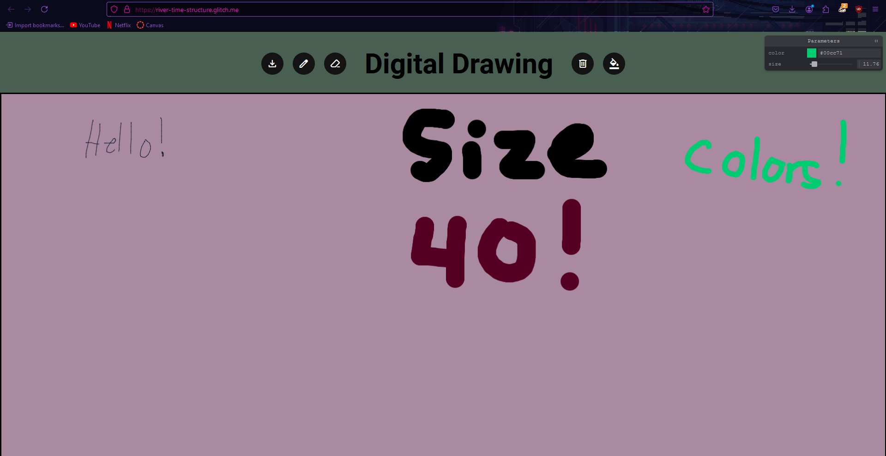

Digital Drawing

your hosting link e.g. https://a4-rose-strobelwpi.glitch.me

My project is a drawing app using the 2D canvas element. I used the pointer events to track when the mouse is clicked, or when the pointer becomes active. I did the same  using pointer move, which tracks when the pointer changes coordinates, pointer up, which tracks when the mouse is no longer clicked, and pointer out which tracks when the pointer is no longer in the canvas. I then included the drawing logic using the ctx line to and move to functions, which creates a line from where the mouse starts, to where the mouse ends. I added a few functionalities, such as the download icon, which will download the image you created. The pen icon, which switches your tool to a pen to draw. The eraser icon, which switches your tool to an eraser. The trash icon, which clears the entire canvas. Finally, I added the fill icon, which will fill your canvas with the color you are currently using. You can see which color you are using with the parameters pane. I used tweakpane. With tweapane, users can adjust the color that they are using to draw or fill the canvas with, as well as the size of their pen tool. The goal of this project is to use your creativity and draw to your hearts content! Some challenges were figuring out how to connect tweakpane with other color and size variables because it was not shown clearly in the website's documents.

